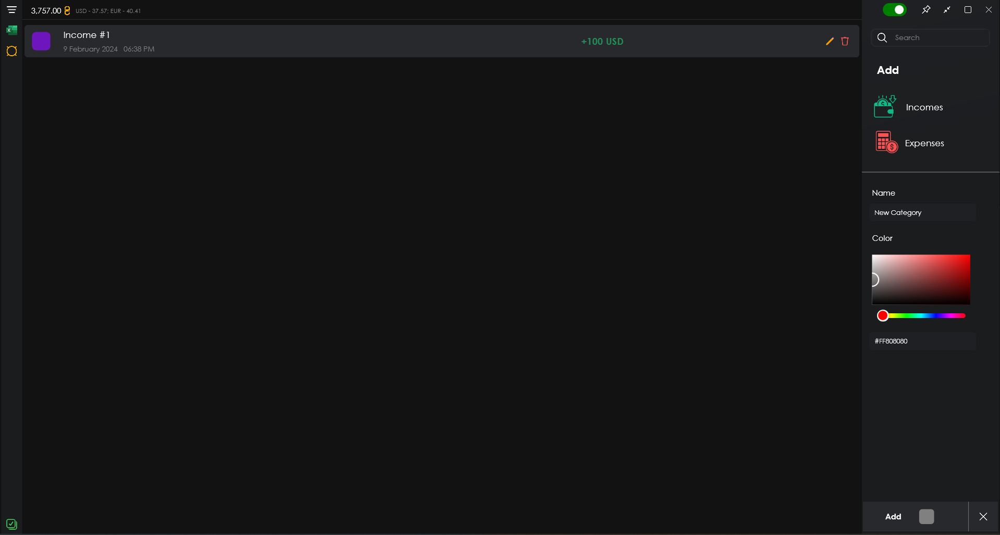
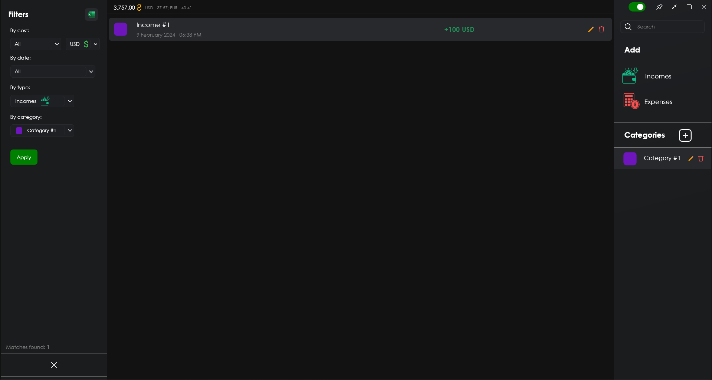

# "Accounting App" project description

**"Accounting App"** - is a project application designed for accounting work, maintaining a list of income and expenses by categories in three currencies <u>**(USD, EUR, UAH)**</u>, developed using **WPF .NET Core**. Core functionality includes:
- Manipulation of the list of financial elements (Income / Expense)
- Categorisation of financial items 
- Sorting of financial items
- Converting the list of financial items to an Excel spreadsheet

## Adding a new financial element:

To add a new **income / expense** financial element you need to click on the ***"Incomes" / "Expenses"*** button respectively and a panel will appear at the bottom right corner to fill in the information on the following items:
- Name
- Amount
- Category
- Currency
- Description (optional)

Next, by clicking on the ***"Add"*** button, the item will be added to the list.

## Adding a new category:

To add a new category you need to click on the plus button with the title ***"Categories"*** on the right side, and a panel to add a new category will appear in the bottom right corner with the following items:
- Name
- Colour

Then by clicking on the ***"Add"*** button, the item will be added to the list of categories.

## Editing a financial item:

To edit or update the information in a financial item, you need to select the corresponding item in the list by clicking on it and on the right side click on the button with a **pencil icon**, a panel with the current data available for editing will appear in the bottom right corner of the application.

## Editing a category:

To edit or update information about a category, as in the case of a financial item you need to select the corresponding item and click on the button with the **pencil icon**. In the panel that appears, you will be able to make changes.

## Deleting items:
To remove a financial item or category from the respective lists, select the desired item and click on the button with the **basket icon**.

## Sorting financial items:

To sort the items in the list, you need to click on the button with **three lines** in the top left corner of the application and a panel with sorting options will appear on the left side, that is:
- Amount
- Currency
- Date of creation
- Type
- Category

You will also be able to **observe the number of matches** for the selected parameters at the bottom.

## Converting financial items to Excel spreadsheet:

In order to convert all financial items or already sorted ones, it is necessary to click on the button with the **Microsoft Excel icon** in the upper left corner. In the panel that appears, you will be able to observe the following items:
- Table file name
- File saving directory
- Sorting category
- Mode (From sorted or not)

If the conversion mode is not specified ***"From sorted"***, then all items from the local application database will be compiled into the table.

## Setting currency values:

There is no actual way to retrieve currency data in the application, it must be specified manually. The button to open the corresponding panel is located on the left side below the ***"Sort"*** and ***"Convert"*** buttons.

There is also a summarised value of all income and expenses in hryvnia (UAH) at the top right of the ***"Sort"*** button.

### Conclusion:
To summarise the above, "Accounting App" has a user-friendly and understandable interface, sufficient but specialised functionality.
