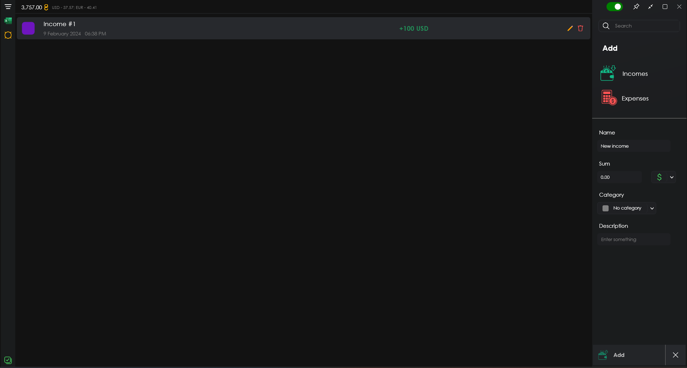
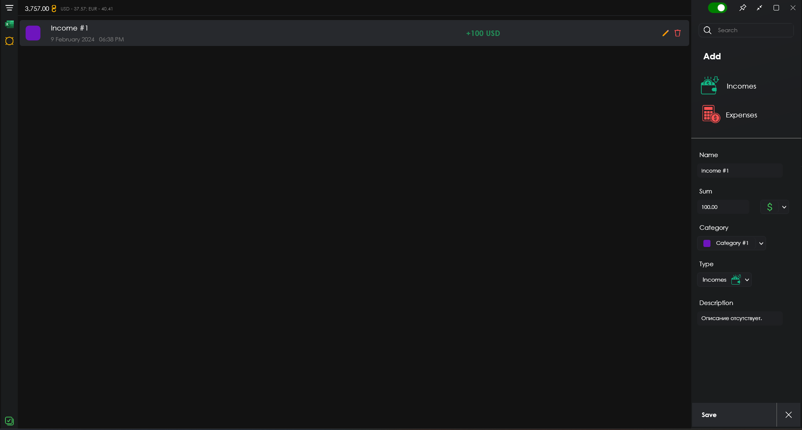
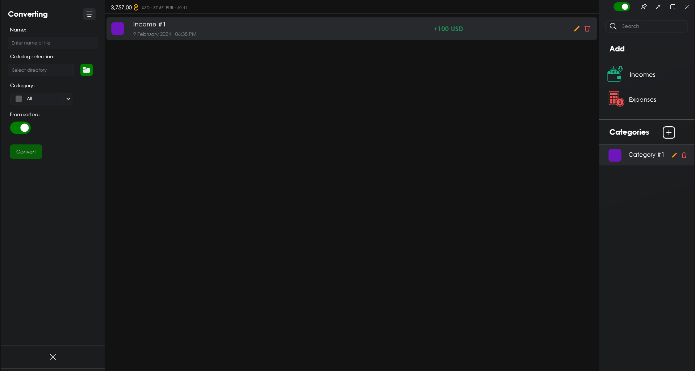
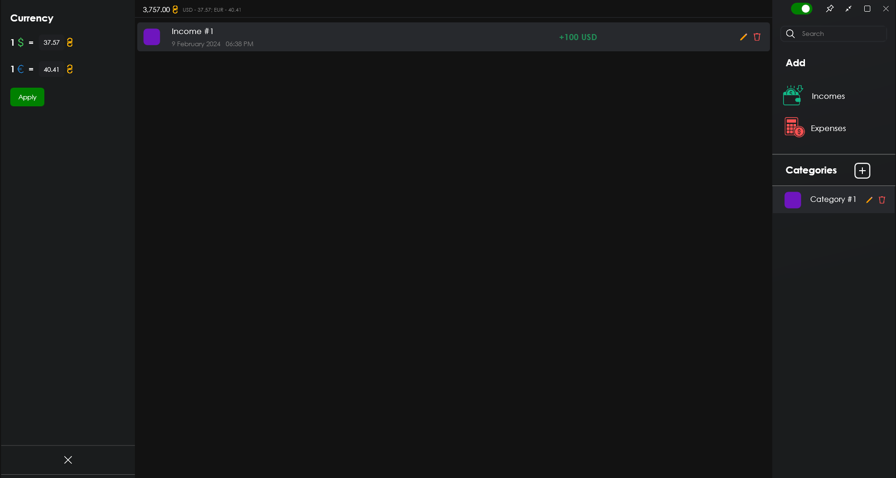

# Описание проекта "Accounting App"

## Языки
- [English](./README.md)
- [Українська](./README_UA.md)
- [Русский](./README_RU.md)

**"Accounting App"** - это проект приложение, предназначенное для ведения бухгалтерского учета, ведения списка доходов и расходов по категориям в трех валютах <u>**(USD, EUR, UAH)**</u>, разработанное с использованием **WPF .NET Core**. Основная функциональность включает в себя:
- Управление списком финансовых элементов (Доходы / Расходы);
- Компоновка по категориям финансовых элементов;
- Сортировка финансовых элементов;
- Преобразование списка финансовых элементов в электронную таблицу Excel.

## Добавление нового финансового элемента:

Чтобы добавить новый **доходный / расходный** финансовый элемент, необходимо нажать на кнопку ***"Доходы" / "Расходы "*** соответственно, и в правом нижнем углу появится панель для заполнения информации по следующим пунктам:
- Название
- Сумма
- Категория
- Валюта
- Описание (необязательно)

Далее, нажав на кнопку ***"Добавить "***, элемент будет добавлен в список.

## Добавление новой категории:

Для добавления новой категории необходимо нажать на кнопку с плюсом и заголовком ***"Категории "*** справа, после чего в правом нижнем углу появится панель для добавления новой категории со следующими элементами:
- Название
- Цвет

Затем, нажав на кнопку ***"Добавить "***, элемент будет добавлен в список категорий.

## Редактирование финансового элемента:

Чтобы отредактировать или обновить информацию в финансовой статье, необходимо выбрать соответствующую статью в списке, кликнув по ней, и справа нажать на кнопку с иконкой **карандаша**, в правом нижнем углу приложения появится панель с текущими данными, доступными для редактирования.

## Редактирование категории:

Чтобы отредактировать или обновить информацию о категории, как в случае с финансовой статьей, необходимо выбрать соответствующую статью и нажать на кнопку со значком **карандаша**. В появившейся панели вы сможете внести изменения.

## Удаление элементов:
Чтобы удалить финансовую статью или категорию из соответствующих списков, выберите нужную статью и нажмите на кнопку со значком **корзины**.

## Сортировка финансовых статей:

Чтобы отсортировать элементы в списке, нужно нажать на кнопку с **тремя линиями** в левом верхнем углу приложения, и слева появится панель с вариантами сортировки, а именно:
- Сумма
- Валюта
- Дата создания
- Тип
- Категория

Вы также сможете **наблюдать количество совпадений** для выбранных параметров внизу.

## Преобразование финансовых статей в таблицу Excel:

Для того чтобы преобразовать все финансовые статьи или уже отсортированные, необходимо нажать на кнопку со значком **Microsoft Excel** в левом верхнем углу. В появившейся панели вы сможете увидеть следующие элементы:
- Имя файла таблицы
- Каталог сохранения файла
- Категория сортировки
- Режим (с сортировкой или без)

Если режим конвертации не указан ***"Из отсортированных "***, то в таблицу будут скомпилированы все элементы из локальной базы данных приложения.

## Установка значений валют:

В приложении нет фактического способа получения данных о валюте, их необходимо указывать вручную. Кнопка для открытия соответствующей панели расположена слева под кнопками ***"Сортировка "*** и ***"Конвертация "***.

Также справа вверху от кнопки ***"Сортировать "*** находится суммарное значение всех доходов и расходов в гривнах.

## Заключение:
Подводя итог вышесказанному, можно сказать, что "Бухгалтерское приложение" обладает удобным и понятным интерфейсом, достаточным, но специализированным функционалом.
