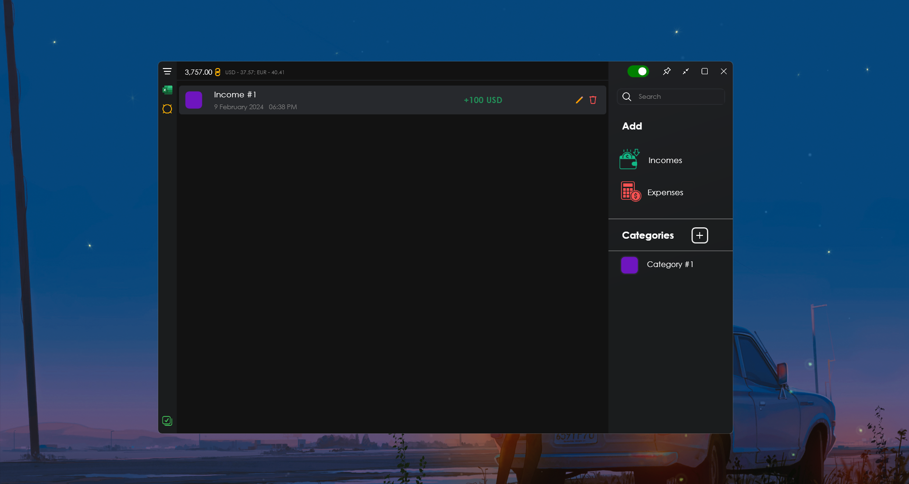
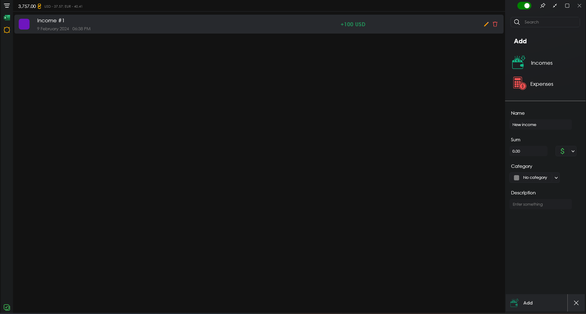
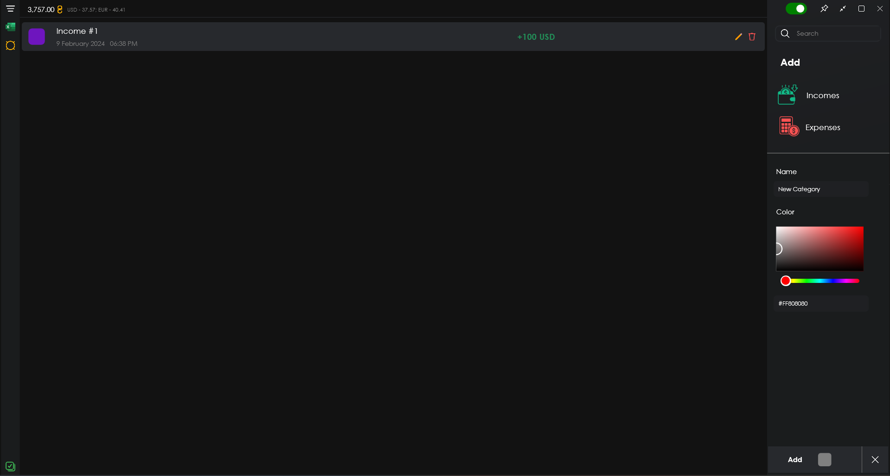
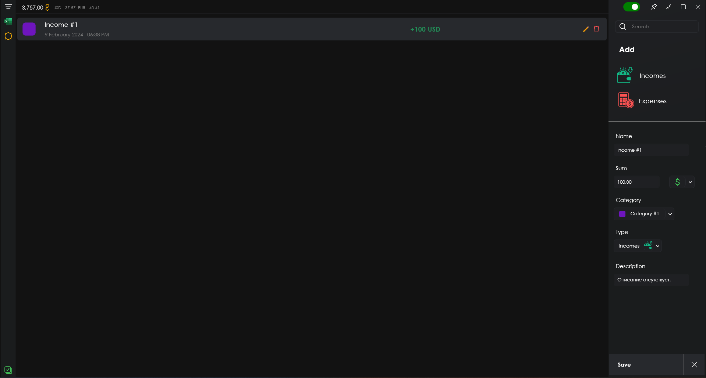
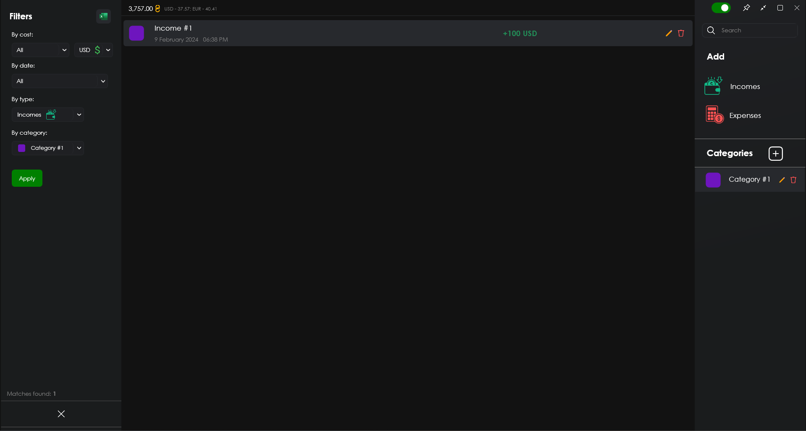
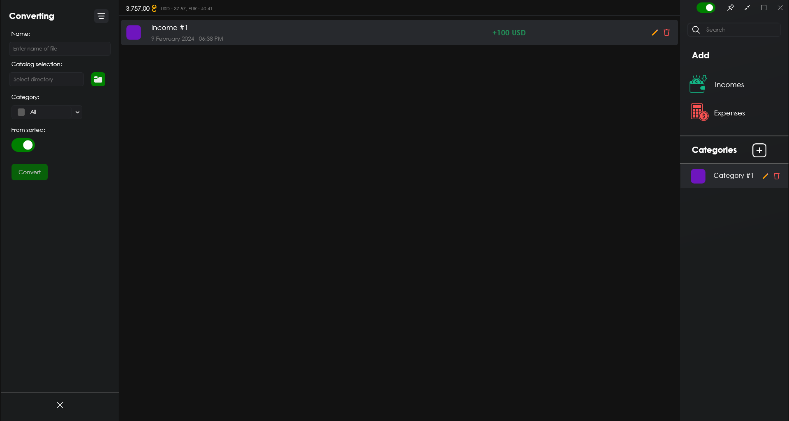
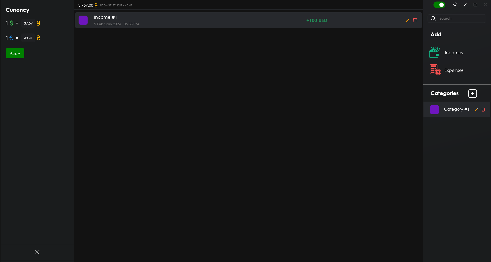

# Опис проекту "Accounting App"

## Мови
- [English](./README.md)
- [Русский](./README_RU.md)
- [Українська](./README_UA.md)

**"Accounting App"** - проектний додаток, призначений для ведення бухгалтерської роботи, ведення списку доходів та витрат за категоріями у трьох валютах <u>**(USD, EUR, UAH)**</u>, розроблений з використанням **WPF .NET Core**. Основна функціональність включає в себе:
- Керування списком фінансових елементів (Доходи / Витрати);
- Компонування за категоріями фінансових елементів;
- Сортування фінансових елементів;
- Перетворення списку фінансових елементів в електронну таблицю Excel.

## Додавання нового фінансового елемента:

Для додавання нового фінансового елемента **доходи/витрати** необхідно натиснути на кнопку ***"Доходи"/"Витрати "*** відповідно, після чого в правому нижньому куті з'явиться панель для заповнення інформації по наступним елементам:
- Назва
- Сума
- Категорія
- Валюта
- Опис (необов'язково)

Далі, натиснувши на кнопку ***"Додати "***, товар буде додано до списку.

## Додавання нової категорії:

Для додавання нової категорії необхідно натиснути на кнопку з плюсом з написом ***"Категорії "*** з правого боку, після чого в правому нижньому куті з'явиться панель для додавання нової категорії з наступними елементами:
- Назва
- Колір

Після цього, натиснувши на кнопку ***"Додати "***, позиція буде додана до списку категорій.

## Редагування фінансової позиції:

Для редагування або оновлення інформації у фінансовій позиції необхідно вибрати відповідну позицію в списку, натиснувши на неї, і з правого боку натиснути на кнопку з іконкою **олівця**, в правому нижньому куті програми з'явиться панель з поточними даними, доступними для редагування.

## Редагування категорії:

Для редагування або оновлення інформації про категорію, як і у випадку з фінансовою статтею, необхідно вибрати відповідну статтю і натиснути на кнопку з іконкою **олівця**. На панелі, що з'явиться, ви зможете внести зміни.

## Видалення позицій:
Щоб видалити фінансову позицію або категорію з відповідних списків, виберіть потрібну позицію і натисніть на кнопку із зображенням **кошика**.

## Сортування фінансових позицій:

Для сортування позицій у списку необхідно натиснути на кнопку з **трьома лініями** у верхньому лівому кутку додатку і зліва з'явиться панель з опціями сортування, тобто
- Сума
- Валюта
- Дата створення
- Тип
- Категорія

Ви також зможете **спостерігати кількість збігів** для вибраних параметрів внизу.

## Конвертація фінансових елементів в таблицю Excel:

Для того, щоб конвертувати всі фінансові елементи або вже відсортовані, необхідно натиснути на кнопку з іконкою **Microsoft Excel** у верхньому лівому кутку. На панелі, що з'явиться, ви зможете побачити наступні елементи:
- Ім'я файлу таблиці
- Каталог збереження файлу
- Категорія сортування
- Режим (З сортуванням або без)

Якщо режим перетворення не вказано ***"From sorted "***, то в таблицю будуть зібрані всі елементи з локальної бази даних додатку.

## Встановлення значень валют:

У додатку немає можливості отримати дані про валюту, її потрібно вказати вручну. Кнопка для відкриття відповідної панелі знаходиться зліва під кнопками ***"Сортувати "*** та ***"Конвертувати "***.

Також у правому верхньому куті над кнопкою ***"Сортувати "*** відображається підсумкове значення всіх доходів і витрат у гривнях (UAH).

## Висновок:
Підсумовуючи вищесказане, "Бухгалтерський додаток" має зручний і зрозумілий інтерфейс, достатній, але спеціалізований функціонал.
